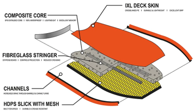
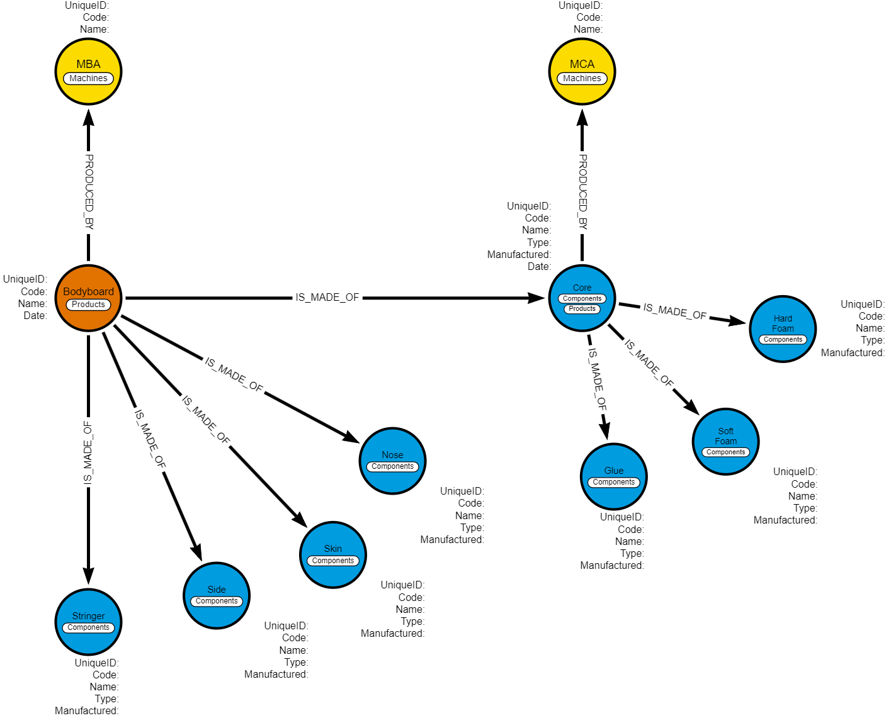

# Neo4j Open Exercise (Modeling, Cypher Queries, and Going Further)

### Introduction

The aim of this exercise is to explore an example that is not so far from our daily journey at ACC by taking the example of the **LAKANO** company. This company, based in Lacanau, manufactures bodyboards (see figure 1) and is asking its engineering department to figure out a traceability solution for them to be able to track their products.

<center>
    <div style="display:flex;flex-direction:column;padding:0 20%">
        
        <span>Fig1: Bodyboard Schema </span>
    </div>
</center>

First, they want to focus on two types of traceability:

- _genetic traceability_: which products are used to produce another one
- _machine traceability_: which machines were used to produce a given product.

### Simplification

#### Products Manufactured

The LAKANO company produces two different products: the `classic` and the `performance` bodyboards. The difference between both is that the performance one has stringers to make it more robust and allow the surfer to take higher waves.

#### Recipe / Product Structure

We are simplifying to represent a bodyboard easily as a graph. Here is our product recipe:

```txt
-- bodyboard (1x)
---- nose (1x)
---- skin (1x)
---- sides (2x)
---- core (1x)
------ soft foam (1x)
------ hard foam (1x)
------ glue (1x)
------ stringer (0x or 2x)
```

#### Technical Document

Here you will find different table extracts coming from the product lifecycle management tool of the company LAKANO.

##### Bill of Materials (representing product recipes):

###### Performance Bodyboard

| Component Name | Component Code | Type         |
| -------------- | -------------- | ------------ |
| Bodyboard      | PBD            | Manufactured |
| Skin           | PSK            | Purchased    |
| Side           | PSD            | Purchased    |
| Core           | PCR            | Manufactured |
| Soft Foam      | PSF            | Purchased    |
| Hard Foam      | PHF            | Purchased    |
| Glue           | PGL            | Purchased    |
| Stringer       | PST            | Purchased    |

###### Classic Bodyboard

| Component Name | Component Code | Type         |
| -------------- | -------------- | ------------ |
| Bodyboard      | CBD            | Manufactured |
| Skin           | CSK            | Purchased    |
| Side           | CSD            | Purchased    |
| Core           | CCR            | Manufactured |
| Soft Foam      | CSF            | Purchased    |
| Hard Foam      | CHF            | Purchased    |
| Glue           | CGL            | Purchased    |

##### Bill of Equipment (Representing the factory and machines and their location, here the same machines are used for Classic and Performance Bodyboards, the `X` represents the machine ID increment (1, 2, 3, or 4) as there could be multiple machines of the same type)

| Machine Name/Function | Machine Code | Number |
| --------------------- | ------------ | ------ |
| Bodyboard Assembly    | MBAX         | 4      |
| Core Assembly         | MCAX         | 4      |

##### Unique ID nomenclature of an item

Each product (final and intermediate) has a unique product ID following this nomenclature: `{product_code}{machine_code}{date}{increment}` with the date having the following format `YYYYMMDD` and increment going from 001 to 999 as the production per product type per machine will never exceed 999. Note: for purchased items, the machine code will be replaced by XXXX and the date will be the date of arrival in the warehouse.

An example for the first Performance bodyboard produced of the year on machine MBA1 will have the following traceability ID `CBDMBA120240101001`.

### Questions

#### 1. Modeling

For these questions, a suggestion will be to use the web app [Arrows](https://arrows.app/).

1. Your first exercise will be to model a generic graph representing product nodes with their product relationships.
   
   <center>
        <div style="display:flex;flex-direction:column;color: yellow;padding:0 20%">
            
            <span style="color: yellow;">answer1: Product nodes and relationship with the components nodes. The property "Manufactured" is a Boolean, so we can distinguish what is manufactred or not.  </span>
        </div>
    </center>

2. Now please add the machine nodes and edges to this representation.

   <center>
        <div style="display:flex;flex-direction:column;padding:0 20%">
            
            <span>answer2: Product and Machine nodes </span>
        </div>
    </center>
    
3. Finally, we now want to extend the graph to purchased items supplier traceability. For that, we know that Core Purchased items are supplied by the company `CORETECH` and Bodyboard Purchased items are supplied by the company `SKIN&SKIM`. Add supplier nodes and edges to your representation.

#### 2. Queries

In this part, if you could generate some mock data to a local or online Neo4j instance, that will help you to query your graph to validate your requests. Nevertheless, this generation is optional.

All code parts from this section should be written in Cypher.

1. Write a query to retrieve all components of a given bodyboard.

2. Write a query to count how many items have been produced using the `MBA1` machine.

3. Write a trigger to set the date of production as a node property [Optional]. Then write the same query as question 2 but add "and during the month of April".

4. Write a query to verify that all performance bodyboards are composed of two stringers.

5. We figured out that glue used was defective for some classic bodyboards. Here is the ID: `CGLXXXX20240101023`. We want you to output bodyboard IDs made from this glue.

#### 3. Going further

1. Imagine that the LAKANO company is going global and opens two other factories in Nazare (Portugal) and Tahiti (France). How can you tune the graph to be able to track the factory location?

2. We're producing more and more and so are facing issues when searching inside the graph. What could be solutions to optimize the search efficiency?

3. The quality team is asking to have easy access to production properties. For example, when the core is assembled, the glue is heated at a given temperature. The max of this temperature is saved. What could be your solution to embed such properties into the graph and what could be a possible query to retrieve the core glue temperature of a given module?
